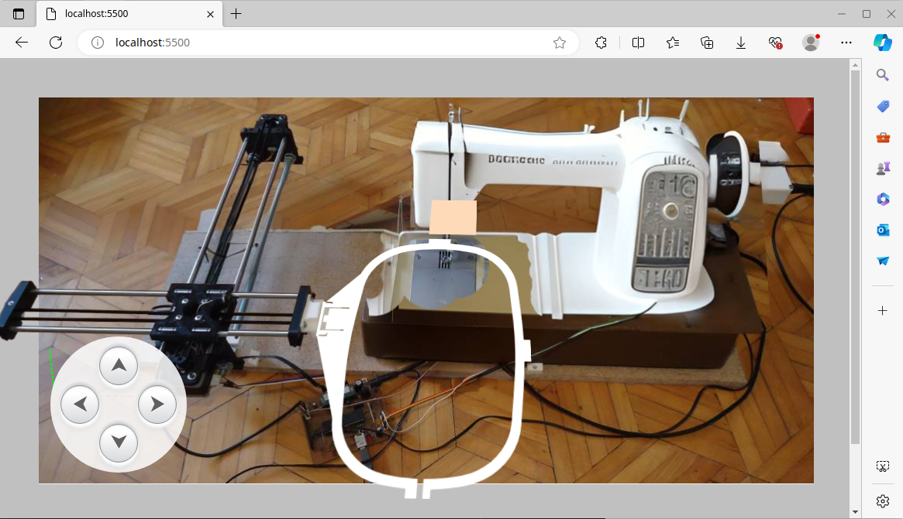

# VEM - Virtual Embroidery Machine
Web-based embroidery machine simulation that execute GCODE sent from [Embroiderino](https://github.com/openembroidery/embroiderino)

## Motivation
"Driven by the bold ambition to build a computer-controlled embroidery machine, I have spent years reading articles on the subject. However, I often got lost, possibly due to my lack of electronics background. That’s why I created this virtual embroidery machine, allowing me to begin cataloging the issues. This visualization has been instrumental in helping me find solutions to every detail of my uncertainties."

## How?
Every single milimeter in real hardware is exactly 1 pixel in this simulation.
eg. your 400mm rods are written here as 400px tall literally. \
Those then roated 90degree in 3d space by CSS 